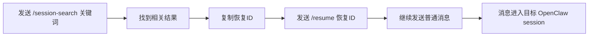

<callout emoji="✅" background-color="light-green">
本文说明 OpenClaw Session Search 插件的完整使用链路：先用 /session-search 找历史会话，再用 /resume 查看可恢复会话，最后用 /resume <会话或恢复ID> 继续指定会话。
</callout>

## 一、用户如何使用

### 1. 搜索历史会话

在飞书里发送：

```text
/session-search 你好
```

插件会搜索最近的用户可见 OpenClaw 会话 transcript，并直接返回确定性的文本结果，不经过模型总结。

示例：

```text
历史会话搜索：你好

结果 5 条 | 可见会话 7 个 | 过滤 1 个 | 12ms (rg)

--- 1/5 ---
会话：resume-test-alpha
恢复ID：agent:main:resume-test-alpha
命中时间：2026/5/15 20:34:14
最近交流：2026/5/15 20:36:28
角色：用户
片段：你好，你以后回复我都带“哦”结尾
```

字段说明：

<lark-table header-row="true">

| 字段 | 含义 | 用户怎么用 |
|---|---|---|
| 会话 | 用户可读的会话名；没有 label 时显示 session key | 用来判断是不是目标会话 |
| 恢复ID | 稳定 session key | 推荐复制到 `/resume <恢复ID>` |
| 命中时间 | 关键词命中的那条消息时间 | 判断搜索结果是否相关 |
| 最近交流 | 该会话最近一次用户/助手/系统消息时间 | 判断会话是否新 |
| 角色 | 命中消息的角色 | 判断是用户说过还是助手回复过 |
| 片段 | 清理后的命中文本 | 快速确认上下文 |

</lark-table>

### 2. 查看可恢复会话

在飞书里发送：

```text
/resume
```

示例：

```text
可恢复会话：7 个
范围：可见会话 7 个

--- 1/7 ---
会话：agent:main:main
创建：2026/5/15 19:33:42
最近交流：2026/5/15 19:57:48
最近：助手：当前没有运行中的可见会话哦。如果需要创建新的子会话来执行任务，可以随时告诉我需求~

--- 2/7 ---
会话：resume-test-alpha
恢复ID：agent:main:resume-test-alpha
创建：2026/5/15 20:08:31
最近交流：2026/5/15 20:36:28
最近：助手：我以后给你回复都会带“哦”结尾哦。

使用：/resume <会话或恢复ID>
```

使用规则：

- 如果显示了 `恢复ID`，优先复制 `恢复ID`。
- 如果 `会话` 本身就是 `agent:...` 形式，也可以直接复制 `会话`。
- 如果担心重名，始终使用 `恢复ID`。

### 3. 恢复指定会话

按 label 恢复：

```text
/resume resume-test-alpha
```

按恢复ID恢复：

```text
/resume agent:main:main
```

成功后返回：

```text
已恢复会话：agent:main:main

恢复ID：agent:main:main
绑定：generic:feishu␟default␟␟user:ou_b68d71bae6ab31447520bf65d4533015
后续消息会继续进入这个会话。
```

之后，在同一个飞书会话里继续发普通消息，OpenClaw 会把消息路由到刚恢复的 session。

### 推荐工作流



<callout emoji="💡" background-color="light-blue">
推荐总是从 /session-search 开始，因为搜索结果里会显示“命中时间”和“片段”，比单纯看 /resume 列表更容易判断是不是目标会话。
</callout>

## 二、技术原理

### 1. 插件暴露面

<lark-table header-row="true">

| 能力 | 名称 | 说明 |
|---|---|---|
| Slash command | `/session-search <keyword>` | 搜索历史会话 |
| Slash command | `/resume [session-label-or-key]` | 列出或恢复会话 |
| Gateway RPC | `session-search.search` | 程序化搜索 |
| Gateway RPC | `session-search.resume` | 程序化恢复 |
| Tool | `session_search` | 给 agent 使用的低频 session 检索工具 |

</lark-table>

Slash command 直接执行插件代码，不调用模型，不做模型总结，因此响应时间和输出格式更可控。

### 2. Session 数据来源

插件读取：

```text
~/.openclaw/agents/<agentId>/sessions/sessions.json
```

并解析每个 session 对应的 transcript：

```text
~/.openclaw/agents/<agentId>/sessions/<sessionId>.jsonl
```

如果 `sessions.json` 里有 `sessionFile`，优先使用 `sessionFile`。插件会检查 transcript 路径必须位于 agent sessions 目录内，避免路径逃逸。

### 3. 可见性过滤

默认只处理用户可见会话。

默认过滤：

- subagent session
- cron session 和 cron run alias
- tool session
- 没有用户通道信息的 internal session
- transcript 路径不安全的 session

这样可以保证 `/session-search` 和 `/resume` 的可见范围一致。

### 4. 搜索实现

搜索优先走 `rg`：

```text
rg --json --fixed-strings --ignore-case --line-number --with-filename
```

如果 `rg` 不可用或失败，插件会退回 Node.js 扫描。

排序规则是确定性的：

1. 匹配分数更高优先
2. 命中消息时间更新优先
3. 会话最近活跃时间更新优先

### 5. 文本清理

飞书 transcript 中可能包含运行时 metadata，例如：

- `Conversation info (untrusted metadata)`
- `Sender (untrusted metadata)`
- fenced JSON metadata
- `System: [...] Feishu[...]` envelope

插件在生成搜索结果时清理这些内容，因此 Gateway RPC 和 slash command 都不会把原始 metadata 展示给用户。

### 6. Resume 解析顺序

`/resume <target>` 按以下顺序解析：

1. 精确匹配 session label
2. 精确匹配 session key
3. 忽略大小写匹配 label
4. 忽略大小写匹配 session key

因此下面两种都支持：

```text
/resume resume-test-alpha
/resume agent:main:main
```

### 7. 会话绑定

解析到目标 session 后，插件调用 OpenClaw 运行时的 session binding service，把当前飞书 conversation 绑定到目标 session：

```json
{
  "targetSessionKey": "agent:main:main",
  "targetKind": "session",
  "placement": "current",
  "conversation": {
    "channel": "feishu",
    "accountId": "default",
    "conversationId": "user:..."
  }
}
```

绑定成功后，后续普通消息会进入目标 session。

### 8. 与 OpenClaw 内置 /resume 的关系

插件注册了 `/resume`。OpenClaw 当前执行顺序是插件命令优先于内置命令，因此飞书里 `/resume` 会先进入插件实现。

<callout emoji="⚠️" background-color="light-yellow">
插件依赖 OpenClaw 运行时的 session binding service 内部 chunk。OpenClaw 升级后应重新执行 live 验证，确认动态导入路径和绑定行为仍然可用。
</callout>

## 三、验证结果

### 1. 静态与部署验证

已验证：

- `node --check index.js`
- `node --check scripts/validate-e2e.mjs`
- `node --check scripts/validate-live-openclaw.mjs`
- gateway 重启成功
- gateway 状态为 `active/running`
- `/resume` 插件命令已注册
- `/session-search` 插件命令已注册

### 2. 本地 300 用例矩阵

命令：

```bash
node scripts/validate-e2e.mjs
```

结果：

```json
{
  "ok": true,
  "cases": 300,
  "resumeList": {
    "count": 3003,
    "filteredCron": 120,
    "filteredSubagent": 120
  },
  "performance": {
    "searchNeedleMs": 131,
    "totalMs": 9740
  }
}
```

覆盖：

- 功能正确性
- 展示字段一致性
- 易用性
- cron/subagent/internal 过滤
- 大数据量行为
- 性能
- 可靠性
- 体验可读性

### 3. 真实 OpenClaw 3000 用例矩阵

命令：

```bash
node scripts/validate-live-openclaw.mjs
```

这套验证只调用真实 `openclaw gateway call`，使用当前真实 `~/.openclaw` 会话和 transcript，并真实执行 resume binding。脚本结束后会恢复：

```text
~/.openclaw/bindings/current-conversations.json
```

结果：

```json
{
  "ok": true,
  "cases": 3001,
  "requestedCases": 3000,
  "liveOnly": true,
  "liveData": {
    "sessions": 7,
    "helloResults": 6,
    "searchBackend": "rg",
    "searchedFiles": 7,
    "filteredSubagent": 1,
    "filteredCron": 0
  },
  "performance": {
    "resumeListMs": 1591,
    "searchHelloMs": 1565,
    "totalMs": 48260
  }
}
```

### 4. Live 验证发现的问题与修复

真实 3000 用例验证发现：某条 `agent:main:main` 搜索片段仍暴露 Feishu sender metadata。

修复：

- 将 transcript snippet 清理下沉到搜索结果生成层。
- Gateway RPC 和 slash command 统一返回清理后的片段。

修复后确认搜索片段变为：

```text
你好~ 有什么需要我帮忙处理的吗？不管是工作任务、信息查询还是日常需求都可以告诉我哦。
你好
你好呀~ 有什么我可以帮你的吗？无论是处理文件、查询信息、安排日程还是其他需求，都可以随时告诉我。
```

### 5. 当前结论

<callout emoji="✅" background-color="light-green">
当前实现已经完成从 /session-search 到 /resume 到 /resume <会话或恢复ID> 的端到端闭环。搜索、列表、恢复、绑定、展示字段、metadata 清理和真实 OpenClaw 验证均已通过。
</callout>

### 6. 当前限制

- live 大数据量验证受当前真实 OpenClaw 会话数量限制。
- 本地矩阵覆盖 thousands-scale generated sessions，live 矩阵覆盖真实部署状态。
- OpenClaw 升级后需要重新跑 `scripts/validate-live-openclaw.mjs`。
